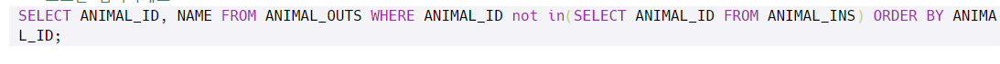

- ANIMAL_INS테이블에서 ID순서로 모든 정보를 출력

- DATETIME을 내림차순으로 정렬해서 첫번째 레코드를 시간으로 바꾼 후 출력

- 고양이, 강아지 순서로 개수를 출력

- Name이 없는 동물을 찾아 ID 출력

- ANIMAL_OUTS에 있는 ID 중에 ANIMAL_INS에 없는 ID 출력

- 특정 NAME 값을 찾아 출력하기 (값은 ' '로 표현!!!)

- 이름이 요구르트인 id이면서 이름이 milk인 ID를 찾아서 출력

- ID역순으로 이름, 날짜를 출력

- 제일 먼저 들어온 시간을 구해서 출력

- name 그룹으로 묶어 name이 2이상 있는 레코드를 name가 불린 횟수로 id 순으로 정렬

  (Group BY 절에서는 조건을 HAVING으로 하기 !!!!!!!!!!!!!!!!!!!!)

- ID순으로 이름있는 레코드의 ID출력

- 두 테이블을 같은 ID 기준으로 조인해서 DATETIME을 비교해 출력

- 개 중에서 이름에 EL이 들어간 ID,NAME 출력

- 아픈 동물 출력하기

- 전체 동물 수 구하기

- 9시부터 20시까지 입양 수 출력하기(Hour(기준 날짜표시) 하면 시간만 출력)

- 이름이 NUll이면 No name으로 출력(IFNULL(컬럼, '집어넣을 문자열') 함수로 해결)

- id가 같은 레코드들을 조인해서 out테이블이 비어있는것중에 3개 출력

- 만약 저게 포함되어있다면 O 없다면 X로 출력

- 호스트아이디 그룹으로 묶어 2개 이상인 아이디들을 모아 이 아이디에 포함 되는 모든 레코드 출력

